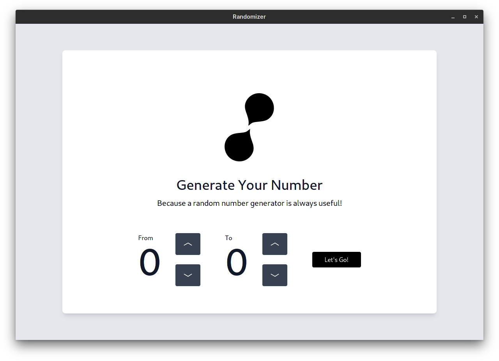

# Randomizer

<!--Badges here-->

A random number generator app that uses the [pywebview](https://https://pywebview.flowrl.com/) library. Read below for more details.



## What is this?

If you're a python developer, you've likely sniggered at the "poor" JavaScript developers. Not only are they forced to use a botchy language and an annoying package manager - they even have to bundle a whole web browser(!) to make a desktop app :(

Of course, I'm talking about ElectronJS. Yes, it's (literally) coarse, rough, irritating, and gets everywhere; but you've got to admit that those sleek electron apps look cool and modern. No Python framework truly comes close to power of HTML, CSS and JS. 

Pywebview is the best of both worlds. It's fast, runs natively, and works cross-platform; but it fits in perfectly to the HTML/CSS/JS family. You can write you app in Python, design its interface in web technologies, and package it as a <10MB binary.

As an example of what you can do with pywebview, I've made this app. It demonstrates many of pywebview's features, such as page transitions, interdomain communication, and passing variables between Python and JavaScript. And yeah - it's also a pretty good random number generator.

# Try it out

Download the AppImage, Mac App or Windows App from [here](#).

Alternatively you can [run from source](#running-from-source).

# Running from source

If you are running from source, be sure to be familiar with the terminal. If not, I suggest you consult [this page](https://www.howtogeek.com/140679/beginner-geek-how-to-start-using-the-linux-terminal/) or [this page](https://www.tutorialspoint.com/powershell/powershell_quick_guide.htm).

## Prerequisites

Before you can run from source, make sure you have dependencies installed:

### MacOS

You need Python 3+ (ideally version 3.3+) installed. To check if you have python installed:

```
[[ "$(python3 -V)" =~ "Python 3" ]] && echo "Python 3 is installed"
```

Then, install pywebview:

```
pip install pywebview
```

You can now proceed to [building and running](#build-and-run).

### Windows

You need Python 3+ (ideally version 3.3+) installed. To check if you have python installed:

```
python --version
```

If the python version is at 2.x.x or the command fails, download python at <https://python.org>.

It is also *recommended* (though not required) that you have `git` installed. 

### Arch-based Linux

> If you're using Arch Linux/Manjaro/Arcolinux (like me) then follow these steps

Install python (though you should have it already):

```
sudo pacman -S python
```

**If you are using Anaconda or Miniconda, please deactivate it like this!**

``` sh
conda config --set auto_activate_base false && CONDA_AUTO_ACTIVATE_BASE=false
```

``` sh
[[ "$(which python)" =~ "/usr/bin/python" ]] && echo "Python installation is correct"
# assuming this command outputs "Python installation is correct", then you're all good!
```

Install GTK and its dependencies:

``` sh
sudo pacman -S python-gobject gtk3
```

Install pywebview via pip:

```
pip install pywebview
```

### Debian-based Linux

> This is for users of Linux Mint, Ubuntu, Debian, ElementaryOS, and others that use the `apt` package manager

Assuming you are using Ubuntu 20+, you will have python3 and pip already installed. If you have not, install it with:

```
sudo apt update && sudo apt install python3.9
```

You will need GTK and python-gobject as well. To install those, run:

```
sudo apt install python3-gi python3-gi-cairo gir1.2-gtk-3.0 gir1.2-webkit2-4.0
```

Then, you need to install pywebview:

```
pip3 install pywebview
```

### Fedora-based Linux

> This is for users of Fedora, CentOS, Red Hat Linux and its other derivatives (specifically those that use the `dnf` package manager)

Fedora-based Linux distributions have python3 preinstalled. If for whatever reason you do not have python3 installed, you may install it like this:

```
sudo dnf install python3
```

Then, install GTK and python-gobject, like this

```

```

Then, you need to install pywebview:

```
pip3 install pywebview
```

### Other Linux distributions

The steps to installing dependencies on all other distributions can be broken down into these general steps:

* Install a version of Python (has to be v3.3+)
* Install GTK and python bindings to GTK
* Run `pip install pywebview`

## Build and run

First, you *must* make sure that you are using a vanilla distribution of python, instead of something like anaconda or miniconda. To check (on Mac and Linux distros):

```
which python
# should show something like: /usr/bin/python
```

To check (on Windows):

```
where python
# should show something like:
# C:\Users\yourusername\AppData\Local\Programs\Python\Python36
```

If this isn't the case, temporarily deactivate Anaconda/Miniconda so that it doesn't override vanilla python. On Mac and Linux, run this command:

```
echo "alias python=/usr/bin/python" >> .zshrc && source ~/.zshrc
```

Unfortunately, Windows users will have to delete Anaconda/Miniconda and install Python again.

Second, download the code, using `git`:

```
git clone https://github.com/Songtech-0912/Randomizer.git && cd random-python
```

Third, run the app:

```
python app.py
```

## Compiling Binaries
